# 试验20230512：理解各数据对植被图精度的影响
试验选取部分列进行删除，找出对植被图分类有用的数据和无用的数据。每次测试时的训练轮数为200轮。随机抽取30%数据用于独立测试。

训练数据：F:/TensorFlow/traindata20230508.csv（样本过少的类别进行了简单的复制）

网络结构：4096->128, loss: categorical_crossentropy, optimizer: adam
## 数据简介（表格中的列）
### 环境相关：
AET, CI, ASPECT, DEM, SLOPE
### 植被相关：
EVI, NDVI, GPP, PSN, LAI, FPAR
### 气候相关：
LST, PR, SOIL
### 多光谱：
SR

## 试验记录
|  | 全部 | 无环境 | 无植被 | 无气候 | 无多光谱 | 仅多光谱 |
| :----: | :----: | :----: | :----: | :----: | :----: | :----: |
| 精度 | 0.853339, 0.656258 | 0.635442 | 0.669235 | 0.708164 | 0.682211 |0.700324 |
### 1.全部数据
用时：00:18:31，训练精度：0.8141

测试精度：0.853339, 0.656258

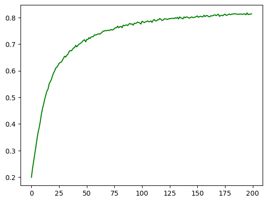

精度

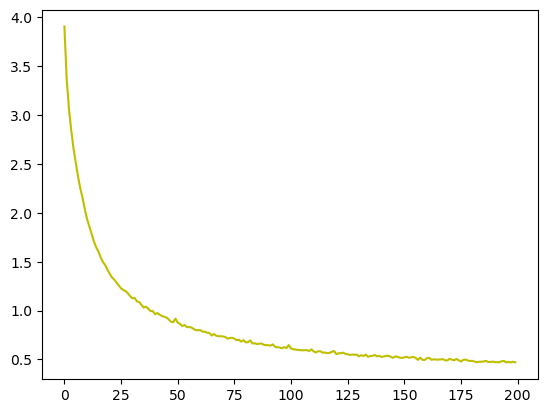

损失

### 2.去除环境相关
用时：00:13:24，训练精度：0.8185

测试精度：0.635442

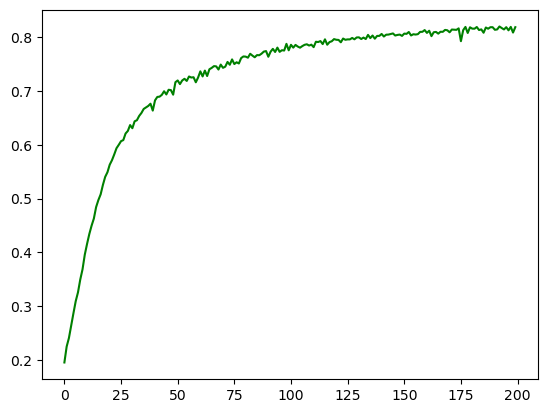

精度

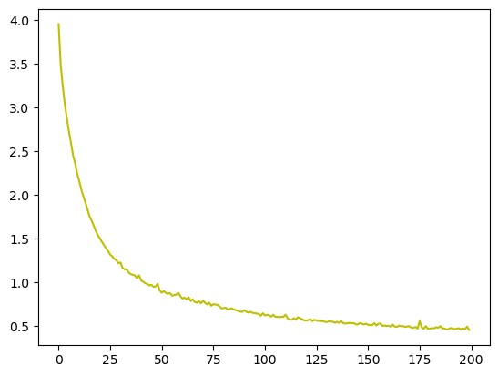

损失

### 3.去除植被相关
用时：00:13:06，训练精度：0.7960

测试精度：0.669235

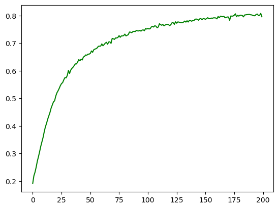

精度

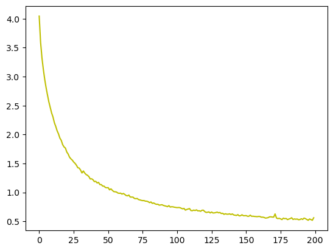

损失

### 4.去除气候相关
用时：00:13:30，训练精度：0.8098

测试精度：0.708164

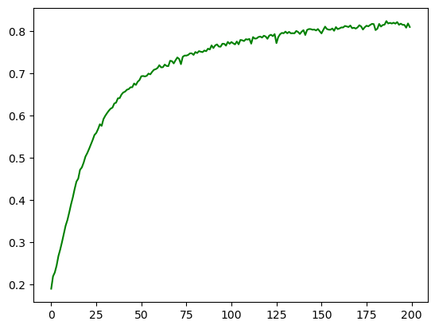

精度

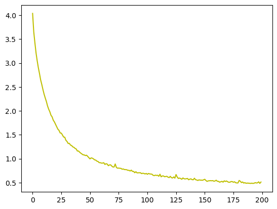

损失

### 5.去除多光谱
用时：00:13:46，训练精度：0.7959

测试精度：0.682211

精度

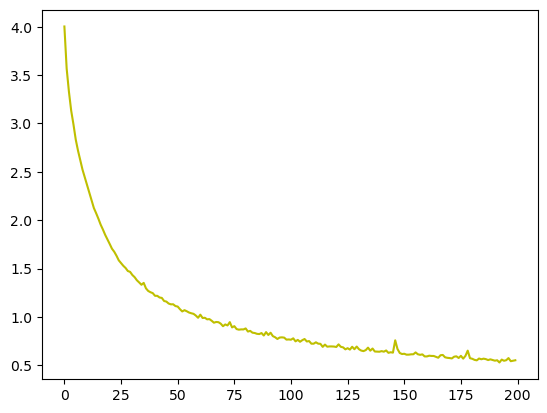

损失

### 6.仅多光谱（SR）
用时：00:12:31，训练精度：0.7899

测试精度：0.700324

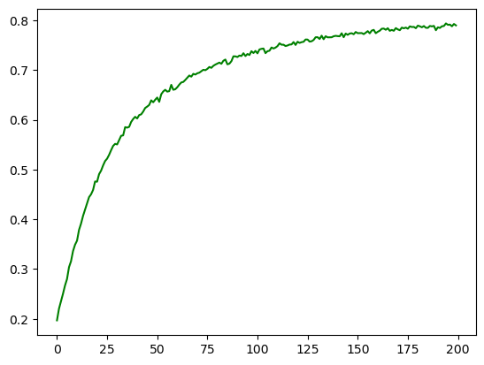

精度

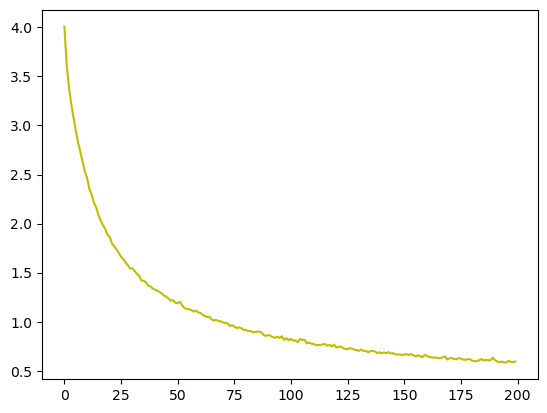

损失
